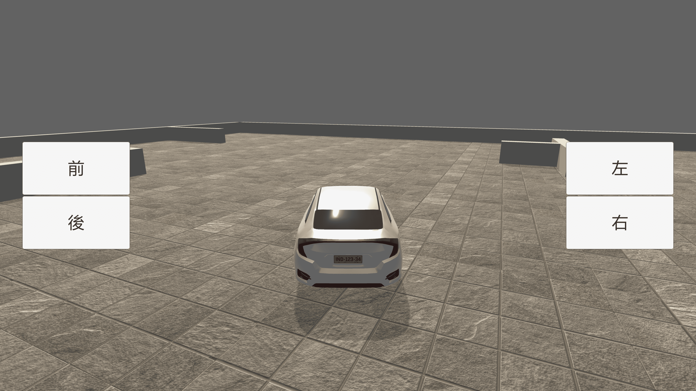

# Practice_CSharp_Basic_Field_Method
 練習 Unity 2019.2.4f1 - C# 基礎：欄位、方法與按鈕

## 練習說明

點上方圖片可以看影片說明
- 請建立四個按鈕並包含自適應
- 建立 C# 並設定影片內的欄位
- 自訂汽車前後移動與左右轉方法
- 按鈕添加 "Event Trigger" 並點選 "Add New Event Type > Update Selected"
- 按鈕按下後會執行前後移動與左右旋轉效果